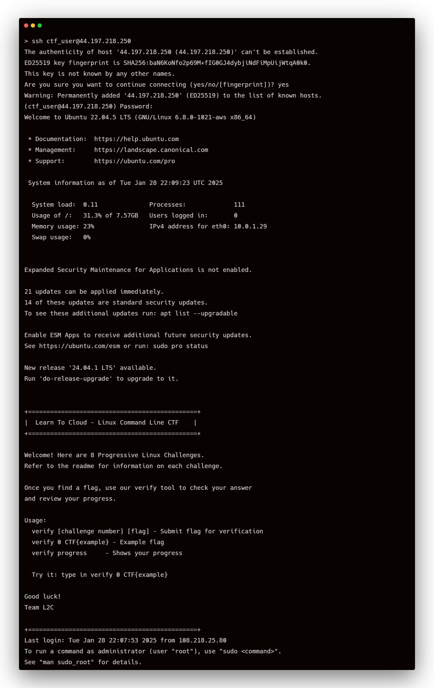

# Linux Command Line CTF Lab - AWS

Welcome to the Linux Command Line Capture The Flag (CTF) lab! This project sets up a learning environment where you can practice your Linux command line skills by solving various challenges.

## Prerequisites

Before you begin, ensure you have the following installed on your local machine:

1. [Terraform](https://www.terraform.io/downloads.html) (version 1.9.0 or later)
2. [AWS CLI](https://aws.amazon.com/cli/) (configured with your AWS credentials)

## Getting Started

Follow these steps to set up and access your CTF lab environment:

1. Clone this repository to your local machine:

    ``` sh
    git clone https://github.com/learntocloud/ltc-linux-challenge
    cd ltc-linux-challenge/aws
    ```

2. (Optional) Modify the AWS region:
    - Open `main.tf` and change the default value of the `aws_region` variable, or
    - Create a `terraform.tfvars` file and specify your preferred region:

        ``` sh
        aws_region = "us-east-1"
        ```

3. Initialize Terraform:

    `terraform init`

4. Apply the Terraform configuration:

    `terraform apply`

    When prompted, type `yes` to confirm.

5. After the apply completes, note the `ctf_instance_public_ip` output. You'll use this to connect to your lab environment.


## Accessing the Lab Environment

To access your lab environment:

1. Use SSH to connect to the EC2 instance:

    ``` sh
      ssh ec2-user@<ctf_instance_public_ip>
    ```

2. When prompted for a password, enter: `CTFpassword123!`
3. Once logged in, you'll see a welcome message with instructions for your first challenge.


## Challenges

Your CTF lab consists of 7 challenges, each testing different Linux command line skills. The challenges are:

1. Find a hidden file
2. Locate a file with "secret" in its name
3. Find the largest file in a specific directory
4. Identify a user with a specific UID
5. Locate a file with specific permissions
6. Find a process running on a specific port
7. Decode a base64 encoded message

Work through these challenges to improve your command line skills and find all the flags!

## Cleaning Up

When you're done with the lab, don't forget to destroy the AWS resources to avoid unnecessary charges:

`terraform destroy`

Type `yes` when prompted to confirm.

## Security Note

This lab is designed for learning purposes and uses a password-based login for simplicity. In real-world scenarios, key-based authentication is recommended for better security.

## Troubleshooting

If you encounter any issues:

1. Ensure your AWS CLI is correctly configured with your credentials.
2. Check that you're using a compatible Terraform version.
3. Verify that you have the necessary AWS permissions to create the required resources.

If problems persist, please open an issue in this repository.

Happy learning, and good luck with your CTF challenges!
