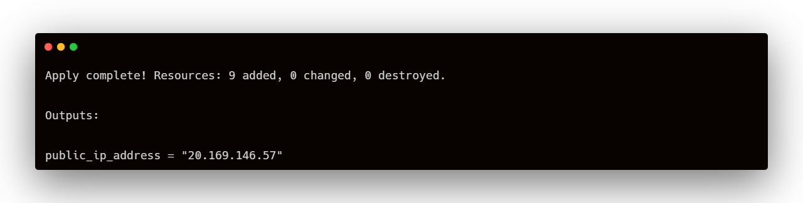
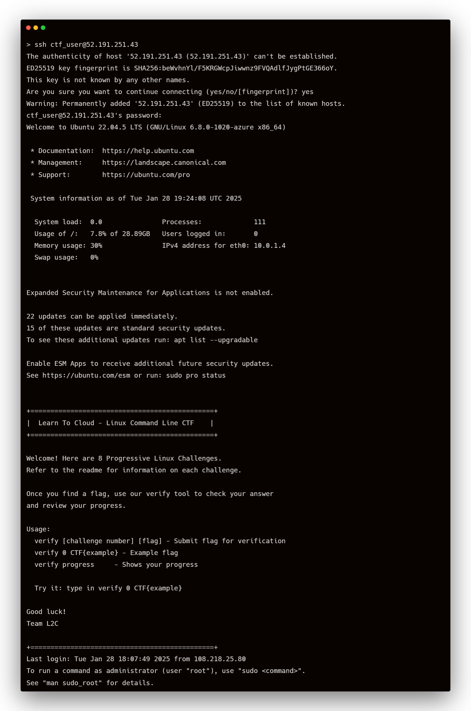

# Linux Command Line CTF Lab - Azure

Welcome to the Linux Command Line Capture The Flag (CTF) lab on Microsoft Azure! This project sets up a learning environment where you can practice your Linux command line skills by solving various challenges.

## Prerequisites

Before you begin, ensure you have the following installed and configured on your local machine:

1. [Terraform](https://developer.hashicorp.com/terraform/install) (version 1.9.0 or later)
2. [Azure CLI](https://learn.microsoft.com/en-us/cli/azure/install-azure-cli)
3. An Azure account with an active subscription

## How much it's going to cost

If you leave this lab running, it's going to cost you $8/month, as it is running `Standard B1s` VM in Azure. Use the `terraform destroy` command to clean resources, once completed with CTFs.

> [!NOTE]  
> You might encounter an error, if your Azure account is a Student account, please look at [this work aroud.](https://github.com/g-now-zero/l2c-guides/blob/main/posts/ctf-azure-spot-instances-guide.md)

## Getting Started

Follow these steps to set up and access your CTF lab environment:

1. Clone this repository to your local machine:

    ``` sh
    git clone https://github.com/learntocloud/ltc-linux-challenge
    cd ltc-linux-challenge/azure
    ```

2. Log in to Azure using the Azure CLI:

    ``` sh
    az login
    ```

3. Initialize Terraform:

    ``` sh
    terraform init
    ```

4. Apply the Terraform configuration:

    ``` sh
    terraform apply -var="az_region=YOUR_AZURE_REGION"
   ```

   Replace `YOUR_AZURE_REGION` with Azure Region that you want to use, by default it uses East US.

   When prompted, type `yes` to confirm.

5. After the apply completes, note the `public_ip_address` output. You'll use this to connect to your lab environment.


## Accessing the Lab Environment

To access your lab environment:

1. Use SSH to connect to the Azure VM as the CTF user:

    ``` sh
    ssh ctf_user@<public_ip_address>
    ```

2. When prompted for a password, enter: `CTFpassword123!`
3. Once logged in, you'll see a welcome message with instructions for your first challenge.


Note: There's also an admin user `azureuser` with password `CTFAdminPassword123!`, but you should use the `ctf_user` account for the challenges.

## Challenges

Your CTF lab consists of 7 challenges, each testing different Linux command line skills. The challenges are:

1. Find a hidden file
2. Locate a file with "secret" in its name
3. Find the largest file in a specific directory
4. Identify a user with a specific UID
5. Locate a file with specific permissions
6. Find a process running on a specific port
7. Decode a base64 encoded message

Work through these challenges to improve your command line skills and find all the flags!

## Cleaning Up

When you're done with the lab, don't forget to destroy the Azure resources to avoid unnecessary charges:

`terraform destroy`

Type `yes` when prompted to confirm.

## Security Note

This lab is designed for learning purposes and uses password-based login for simplicity. In real-world scenarios, key-based authentication is recommended for better security.

## Troubleshooting

If you encounter any issues:

1. Ensure your Azure CLI is correctly installed and configured.
2. Check that you're using a compatible Terraform version.
3. Verify that you have the necessary Azure permissions to create the required resources.
4. If you can't log in immediately after creating the VM, wait a few minutes for the startup script to complete.

If problems persist, please open an issue in this repository.

Happy learning, and good luck with your CTF challenges!
