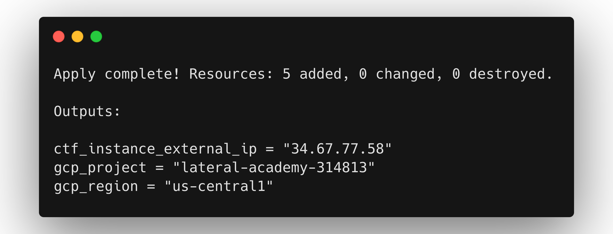
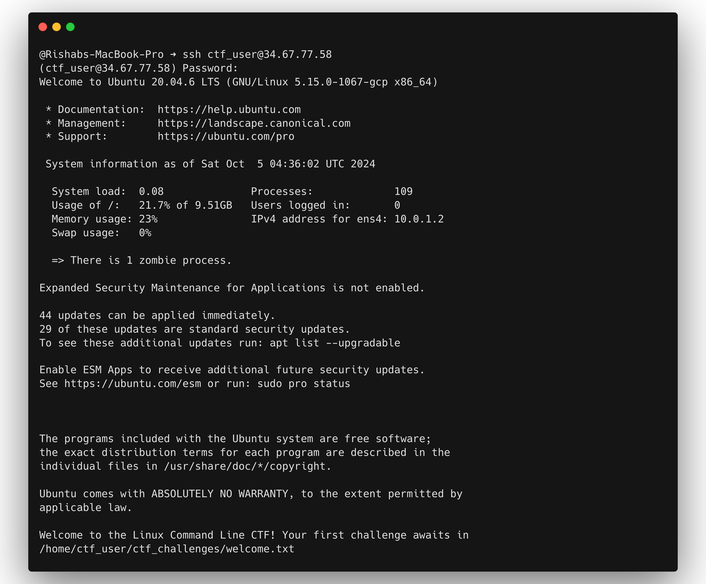

# Linux Command Line CTF Lab - GCP

Welcome to the Linux Command Line Capture The Flag (CTF) lab on Google Cloud Platform! This project sets up a learning environment where you can practice your Linux command line skills by solving various challenges.

## Prerequisites

Before you begin, ensure you have the following installed and configured on your local machine:

1. [Terraform](https://developer.hashicorp.com/terraform/install) (version 1.9.0 or later)
2. [Google Cloud SDK](https://cloud.google.com/sdk/docs/install)
3. A Google Cloud Platform account with billing enabled
4. A GCP project created for this lab

## How much it's going to cost

If you leave this lab running, it's going to cost you $8/month, as it is running `e2-micro` instance in GCP. Use the `terraform destroy` command to clean resources, once completed with CTFs.

## Getting Started

Follow these steps to set up and access your CTF lab environment:

1. Clone this repository to your local machine:

   ``` sh
   git clone https://github.com/learntocloud/ltc-linux-challenge
   cd ltc-linux-challenge/gcp
   ```

2. Authenticate with Google Cloud:

   ``` sh
   gcloud auth application-default login
   ```

3. Initialize Terraform:

   ``` sh
   terraform init
   ```

4. Apply the Terraform configuration:

   ``` sh
   terraform apply -var="gcp_project=YOUR_PROJECT_ID"
   ```

   Replace `YOUR_PROJECT_ID` with your actual GCP project ID.
   When prompted, type `yes` to confirm.

5. After the apply completes, note the `ctf_instance_external_ip` output. You'll use this to connect to your lab environment.


## Accessing the Lab Environment

To access your lab environment:

1. Use SSH to connect to the Compute Engine instance:

   ``` sh
   ssh ctf_user@<ctf_instance_external_ip>
   ```

2. When prompted for a password, enter: `CTFpassword123!`

3. Once logged in, you'll see a welcome message with instructions for your first challenge.


## Challenges

Your CTF lab consists of 7 challenges, each testing different Linux command line skills. The challenges are:

1. Find a hidden file
2. Locate a file with "secret" in its name
3. Find the largest file in a specific directory
4. Identify a user with a specific UID
5. Locate a file with specific permissions
6. Find a process running on a specific port
7. Decode a base64 encoded message

Work through these challenges to improve your command line skills and find all the flags!

## Cleaning Up

When you're done with the lab, don't forget to destroy the GCP resources to avoid unnecessary charges:

```sh
terraform destroy -var="gcp_project=YOUR_PROJECT_ID"
```

Type `yes` when prompted to confirm.

## Security Note

This lab is designed for learning purposes and uses a password-based login for simplicity. In real-world scenarios, key-based authentication is recommended for better security.

## Troubleshooting

If you encounter any issues:

1. Ensure your Google Cloud SDK is correctly installed and configured.
2. Check that you're using a compatible Terraform version.
3. Verify that you have the necessary GCP permissions to create the required resources.
4. Make sure you have billing enabled for your GCP project.
5. If you can't log in immediately after creating the instance, wait a few minutes for the startup script to complete.

If problems persist, please open an issue in this repository.

Happy learning, and good luck with your CTF challenges!
